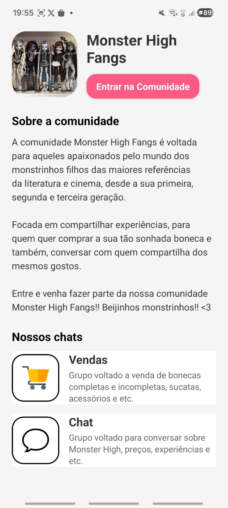

## To Collection App

Integrantes da equipe: isabelli Luiza

1. O aplicativo é basicamente focada no nicho do colecionismo, com várias comunidades que você pode fazer parte com os próprios chats de conversa, vendas e etc.

2. Caso voce não tenha instalado em sua máquina, as dependências do expo para rodar esta aplicação são:

  @react-native-async-storage/async-storage
  @react-navigation/native
  @react-navigation/native-stack
  expo
  expo-camera
  expo-notifications
  expo-sqlite
  expo-status-bar
  react
  react-dom
  react-native
  react-native-safe-area-context
  react-native-screens
  react-native-web

3. Para rodar o seu projeto voce precisa dar o seguinte comando:

npx expo start --tunnel ou somente npx expo start

  

  

  

